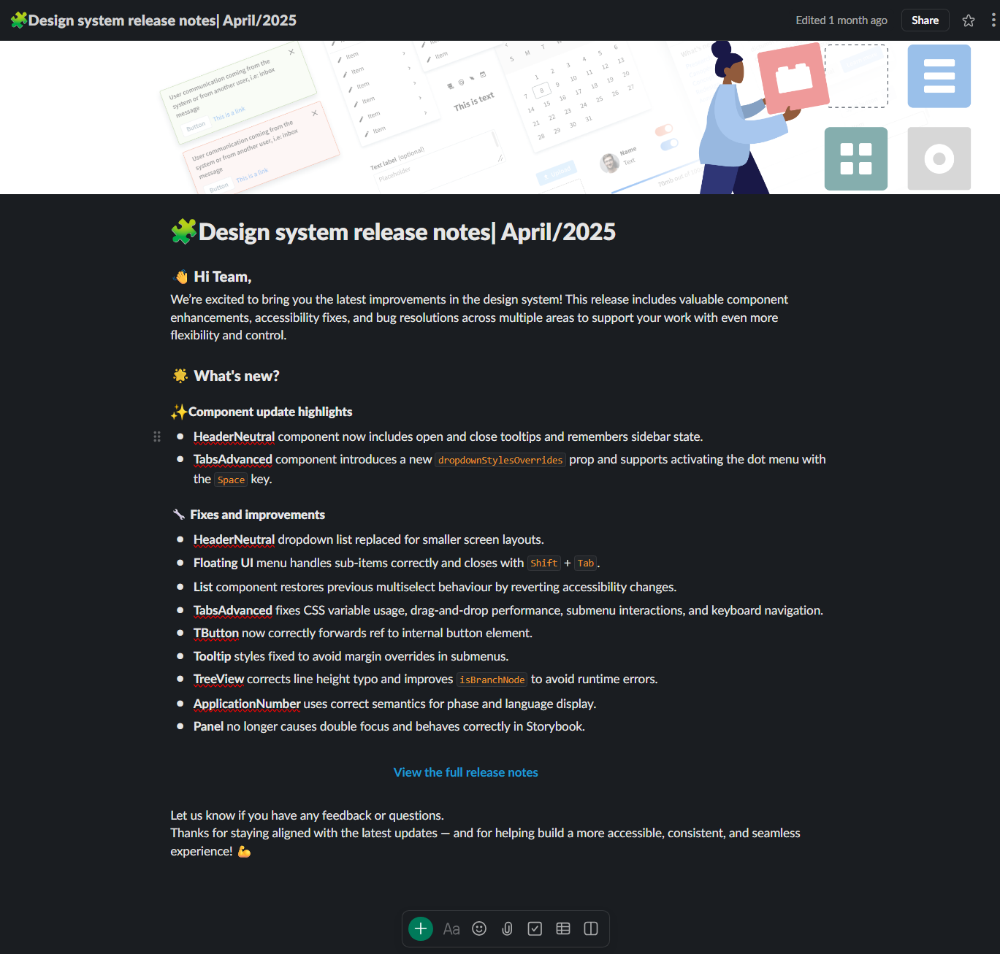
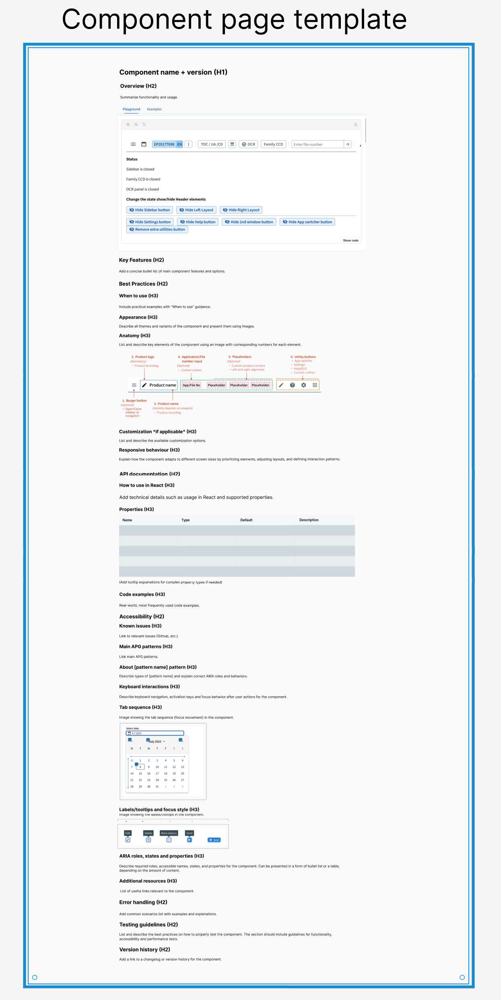
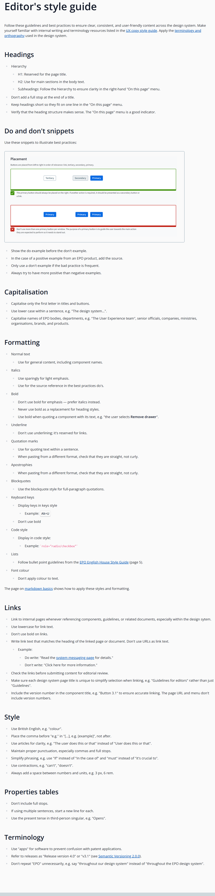
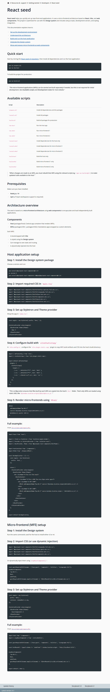

# Michał Wiejacki – Portfolio

## ✍️ Introduction
I'm Michał, a bilingual (EN/PL) **technical writer** and **content specialist** with a background in English Studies and a passion for user-centric communication.

I create accessible, structured documentation for developers, designers, and end users. My experience spans design systems, UX writing, translation, and content optimization.

✍️[CV](CV_Michał_Wiejacki_en.pdf)
📍 Based in Poland  
✉️ wiejacki.mic@gmail.com  
🧰 Tools: Markdown · Git · CMS · Adobe Analytics · AEM · Docs-as-code · GenAI  
🌍 Languages: Polish (native), English (fluent) 

## 🧩 Portfolio Projects

### 🍀 Design System Release Notes
**Role**: Technical Writer – European Patent Office  

**Type**: Internal Communications  

**Highlights**:
- Delivered a clear, structured changelog for key design system updates  
- Improved readability using icons, visual hierarchy, and inline code styling  
- Highlighted accessibility, usability, and performance fixes

**Skills**: Internal release comms · Markdown · UX-focused updates  

 

### 🧱 Component Page Template/Structure Authoring
**Role**: Technical Writer – European Patent Office 

**Type**: Component Documentation Standards  

**Highlights**:
- Co-authored the official template for documenting reusable UI components  
- Defined consistent structure: key features, best practices, code examples, accessibility, and version history  
- Ensured proper content hierarchy for developer and UX needs

**Skills**: Component doc templates · UI documentation · Information architecture

 
 

### ⚛ React Seed Documentation
**Role**: Technical Writer – European Patent Office  

**Type**: Developer Documentation  

**Highlights**:
- Created full onboarding documentation for React-based host and micro-frontend apps  
- Explained architecture, setup steps, and scripts clearly for devs  
- Focused on clarity, modularity, and accessibility
  
**Skills**: Docs-as-code · GitHub workflows · React ecosystem · Markdown  

 

## 🔧 Skills

- **Tools**: Adobe Analytics, Microsoft Office, AEM, GitHub, CMS platforms  
- **Languages**: Polish (native), English (fluent)  
- **Soft Skills**: Clear communication, critical thinking, adaptability, time management

## 🎮 Interests

- Video games & interactive storytelling  
- Digital culture trends (Reddit, TikTok, YouTube)  
- Local basketball (teamwork + strategy)
